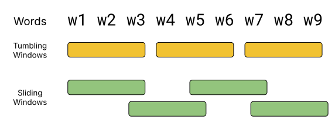
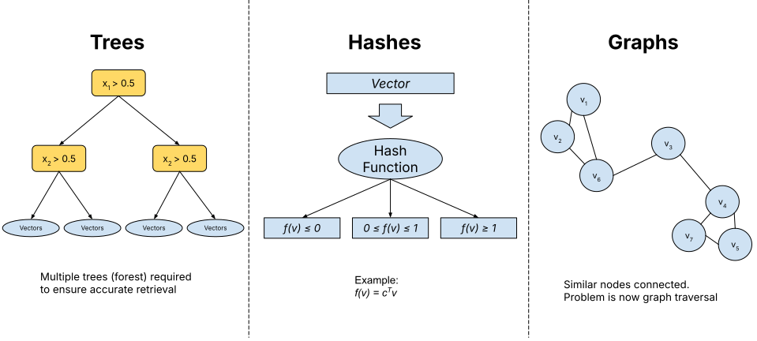
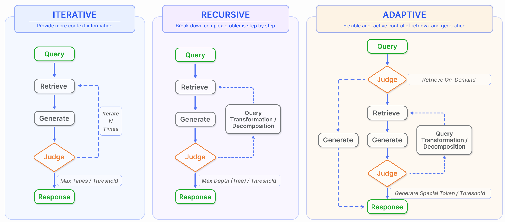

# Retrieval-Augmented Generation

---

## Weaknesses of Generative Models

- Poor performance for domain-specific/knowledge-intensive tasks
- Cannot use novel information
- Hallucinate information
- Computationally expensive

---

### Naive Retrieval-Augmented Generation

- Also called "retrieve-read"
- Input is query
  - "What did JD Vance say last week in Munich?"
- Retrieve relevant documents
  - "JD Vance stuns Munich conference with blistering attack on Europe’s leaders" - The Guardian
- Append retrieved text to input
- Generate answer

---

## Beyond Naive RAG

- Improved Retrieval
- Multiple data sources/hybrid generation
- Pre-retrieval processing
- Post-retrieval processing
- Fine-tuning

---

## Retrieval

- Search engines
  - Can use APIs like Google Search
- Domain-specific databases
  - PubMed for medical information
- Knowledge bases
  - Wikipedia, Wikidata

---

## Chunking

- Document is divided into chunks (e.g., 100 tokens)
- Large chunks capture more context
- Smaller chunks have less noise
- Sliding windows use overlapping chunks

---

## Sliding Window

<!-- .slide: data-background="#fff" -->


---

## Sparse Retrieval

- Documents are retrieved by keywords
- Keywords are extracted from the query
- Reverse index used to find documents

```
{"vance": [doc1, doc2], "munich": [doc2, doc3]}
```

---

## Dense Retrieval

- Documents are encoded into vectors
  - Sentence Transformers
- Query is encoded into a vector
- Similarity search to find relevant documents

---

## Vector Databases

- Efficient storage and retrieval of vectors is challenging
- Approaches split into:
  - Trees
  - Hashing
  - Graphs
- FAISS is a popular library

---

## Approximate Nearest Neighbours

Problem is given a set of vectors, $V$, and a query, $q$, find:

$$ \text{ANN}(q) = \text{argmin}_{v \in V} \text{similarity}(q, v) $$

Similarity can be cosine similarity, Euclidean distance etc.

---

<!-- .slide: data-background="#fff" -->


---

## Hybrid Retrieval

- Use sparse retrieval to find possible candidates
- Rerank using dense vector similarity

---

## Structured Data

- Structured data (e.g., tables, knowledge graphs) can be added.
- Good at collecting related, relevant information
- Must be converted to text

---

## Graph-based Retrieval

- Documents are indexed as nodes in knowledge graph
- Relationships are curated from resources (e.g., Wikidata)
- Graph traversal to find relevant documents
- Graphs can be extracted from text (GraphRAG)

---

## Pre-retrieval Processing

- User query may not be optimal
- Query expansion
  - Using knowledge resources
  - LLMs to generate new queries
- Query reformulation
  - Generate sub-queries
  - Chain-of-thought style generation
- Called "rewrite-retrieve-read"

---

## Post-retrieval Processing - Reranking

- LLMs focus on the beginning and end of the document
- Sorting the documents based on relevance improves performance
- Semantic similarity can be used
- Diversity metrics can avoid repetition

---

## Post-retrieval Processing - Filtering

- Retrieving as many documents as possible does not (always) improve performance
- Information can be filtered by similarity, diversity etc.
- Generative models can summarize extracted information instead

---

### Post-retrieval Processing - Augmentation

- Multiple rounds of retrieval and generation
  - **Iteration**: repeat the retrieval process until quality criteria is met
  - **Recursive**: use generated text to refine query and repeat
  - **Adaptive**: Use judge to decide when to retrieve documents
- Called "retrieve-read-retrieve-read"

---

<!-- .slide: data-background="#fff" -->


<small>From: ["Retrieval-Augmented Generation for Large Language Models: A Survey", Gao et al, 2024](https://arxiv.org/abs/2312.10997)</small>

---


## RAG vs Fine-tuning

- Both methods can adapt an LLM to a task/domain
- Advantages of RAG:
  - Real-time knowledge
  - No (expensive) retraining
- Advantages of fine-tuning:
  - More control over model output
  - Faster query times

---

## Fine-tuning & RAG

- Fine-tuning can be used to improve RAG
  - Fine-tune vectors for retrieval
  - Fine-tune generative model
  - Prompt engineering
  - Automatic generation of prompts

---

## Applications - Question Answering

- RAG does not always benefit question answering
- Best for:
  - Real-time knowledge
  - Highly pertinent information

---

## Applications - Fact Verification & Reasoning

- Fact verification requires authoritative sources
  - RAG provides explicable support for this
  - RAG is more beneficial for this than increased model size
- Commonsense reasoning can be supported by:
  - Providing real-world examples

---

## Applications - Other NLP tasks

- Machine Translation
  - Providing example target language sentences improves translation
- Event extraction
- Summarisation
- Knowledge-base Question Answering

---

## Applications - Code Generation

- RAG is very useful for code generation
  - Method signatures
  - Class definitions
  - Example code snippets

---

## Applications - Non-NLP

- RAG has been used for 
    - Image generation
    - Image captioning
    - Video captioning
    - Audio generation
    - 3D modelling

---

## Summary

- RAG combines retrieval and generation
- Retrieval can be sparse or dense
- Pre-retrieval and post-retrieval processing can improve performance
- RAG is useful for many NLP tasks (and beyond!)


