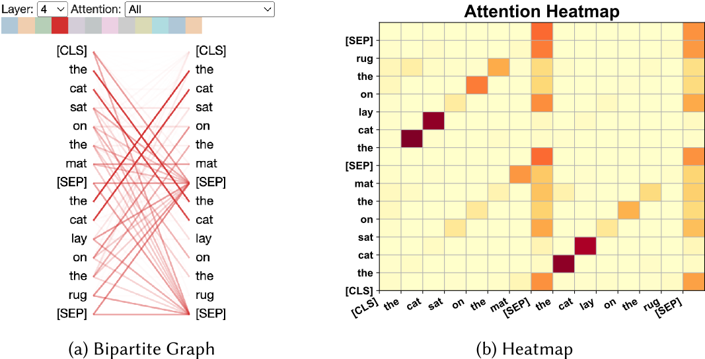

# Explainable NLP

---

## Explainability vs Interpretability

* **Interpretability**: How well can a human understand the model?
* **Explainability**: How well can the model explain its decisions?

---

## Why explain?

* **Transparency**: Understand how the model works
* **Trust**: Trust the model's decisions
* **Bias**: Detect and correct biases
* **Regulation**: Comply with regulations, e.g. GDPR

---

## Performance vs Explainability

* Performance (accuracy) is often at odds with explainability
* Black-box models (e.g. deep learning) are often more accurate
* Traditional methods (e.g. decision trees) are more interpretable
* Discussion: What is meant by "black-box"?

---

## Post-hoc explanations

* **Post-hoc**: Explain after the model has made a decision
* Explanation does not follow the path the model took
* As such, post-hoc explanations are not always accurate

---

## Natural language explanation

* Simply prompt the model to explain its decision
* Explanations tend to be highly plausible
* But may not reflect the model's actual decision

---

## Intrinsic explanations

* **Intrinsic**: Explain while the model is making a decision
* Explanation follows the path the model took
* Explanations may make less sense to humans

---

## Local vs Global Explanations

* **Local**: Explain a single prediction
* **Global**: Explain the model as a whole

---

## Fidelity, plausibility and usability

* **Fidelity**: How well does the explanation reflect the model?
* **Plausibility**: How well does the explanation make sense?
* **Usability**: How well can the explanation be used?

---

## Techniques for explainability

* Feature attribution
* Probing
* Example-based
* Conceptual explanations

---

## Feature attribution

* Feature attributions methods measure the relevance of input features
   * **Pertubation**: Change the input and measure the change in output
   * **Gradient-based**: Use gradients to measure feature importance
   * **Decomposition**: Decompose the model to measure feature importance

---

## Attention features

<!-- .slide: data-background="#ccc" -->

<small>Image source: [Explainability for Large Language Models: A Survey, Zhou et al., 2024](https://dl.acm.org/doi/pdf/10.1145/3639372)</small>

---

## Probing

* Train a shallow classifier on top of the model
* For example:
  * Train a part-of-speech on each layer of an LLM
  * Deduces when model has learned syntax

---

## Example-based

* Example-based explanations illustrate how a model's output changes with different examples
* **Adversarial example**: Search for small changes that change the model's output
* **Counterfactual example**: By perturbations or with another generative model, find examples that affect the output

---

## Conceptual explanations

* Map the inputs to a set of concepts
* For example:
    * For sentiment analysis, map features to adjectives
    * Use adjective sentiment lexicons to explain results

---

## Mechanistic Interpretability

* Explain the model in terms of **circuits**
* A circuit is a subgraph of the neural network
* Example is an **induction head**:
    * One attention head copies information from a previous token
    * A second head copies information from a previous token
* Circuits are difficult to find as features are spread across the network in **superposition**

---

## Discussion

* Feature attribution
* Probing
* Example-based
* Conceptual explanations

Which of these methods are local and global?

---

## Future Directions

* Do explanations make LLMs safer?
* Could explanations be interactive?
* How could neurosymbolic approaches help?
