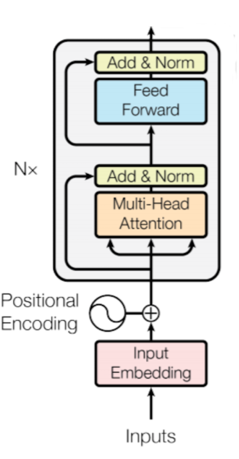
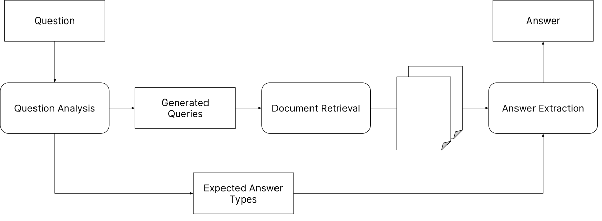
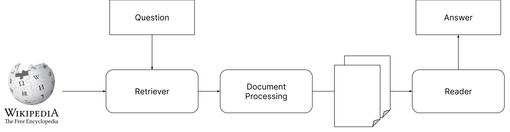
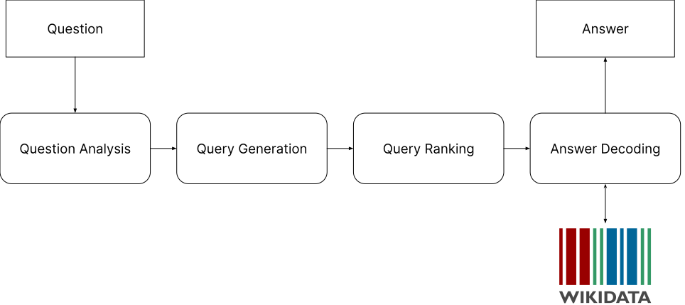
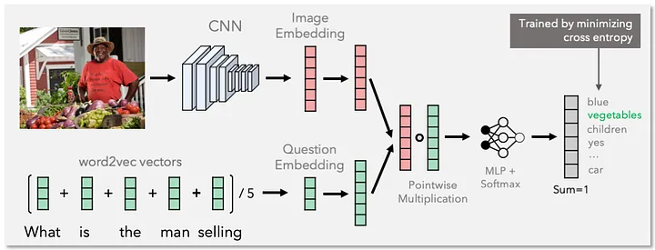

# Summary 

---

## Machine Learning for NLP

Structure of a Neural Network
* Input Layers
* Hidden Layers
* Weights and Biases
* Activation Function
* Output Layer

---

## Machine Learning for NLP

Training a Neural Network
1.  Initialize the weights and biases
2.  Forward Propagation
3.  Calculate the Loss
4.  Backward Propagation
5.  Update the weights and biases

---

## Transformers

Self-Attention
* Self-attention is a mechanism that allows the model to focus on different parts of the input
* It is computed by taking the dot product of the query and key vectors

---

## Transformers 

Multi-head Attention
* To improve the representation power, we compute multiple attention vectors from the same input
* We divide the query, key, and value vectors into $h$ equal parts

---

<!-- .slide: data-background="#fff" -->

---

## Transformers

Other architectural components
* Layer normalization
* Residual connections
* Feed-forward layers
* Positional encoding

---

## Transformers

Training a transformer
* Next Sentence Prediction
* Masked Language Model
* Generation

---

## Transformers

* Decoder-only: Used for language generation tasks
* Encoder-only: Used for tasks like text classification
* Decoder-Encoder: Used for tasks like machine translation

---

## Transformers

Parameter Efficient Methods
* Distillation
* Quantization
* LoRA - Low Rank Adaptation

---

## Transformers

* Sentence embeddings with transformers
* Siamese and Triplet loss

---

## Transformers

Reinforcement Learning
* Use human feedback to improve the model
* Used to train models like GPT

---

## Recurrent Neural Networks

* Sequence models used on time-series data

$$ h^{t} = f(h^{t-1}, x^{t}) $$

$$ y^{t} = g(h^{t}) $$

---

## Recurrent Neural Networks

RNN modes
* Tagging
* Language modelling
* Acceptor (for classification)
* Attention (for classification)

---

## Recurrent Neural Networks

Variants:
* Bidirectional RNN
* LSTM/GRUs
    * Solves issues related to vanishing gradients

---

## Machine Translation

* Rule-based, statistical methods
* IBM models
* Phrase-based models

---

## Machine Translation

* Neural methods
* Sequence-to-sequence models
* Attention models

---

### Retrieval-Augmented Generation

Reasons for RAG
- Poor performance for domain-specific/knowledge-intensive tasks
- Cannot use novel information
- Hallucinate information
- Computationally expensive

---

### Retrieval-Augmented Generation

* Retrieve-read: Retrieve relevant documents and append to input
* Pre-retrieval 
    * Query expansion/rewriting
    * Iterative augmentation
* Post-retrieval processing
    * Sparse Retrieval vs Dense Retrieval
    * Sliding Windows

---

### Retrieval-Augmented Generation

Applications
- Fact verification
- Reasoning
- Code Generation

---

## Code Generation

- Architecture for Code Generation
- Safety and Privacy
- Dataset construction
- RAG for code generation

---

## Code Generation

Evaluation
- Evaluation datasets
- Quality of ChatGPT
- CodeBLEU

---

## Explainable NLP

- Interpretability vs Explainability
- Performance vs Explainability
- Post-hoc explanations
- Intrinsic explanations
    - Local vs Global

---

## Explainable NLP

Techniques
- Feature Attribution
- Probing
- Example-based
- Conceptual explanations

---

## Social Media Analytics

- Data Collection
- Data processing (noisy text)
- Event Detection and Trend Analysis
    - Supervised vs unsupervised

---

## Social Media Analytics

- User and Community Analysis
    - Bot detection
    - Political stance
- Multimedia analysis
- Ethics and privacy

---

## Question Answering

- Open vs closed domain
- Factoid vs non-factoid
    
---

<!-- .slide: data-background="#ccc" -->

Based on https://arxiv.org/pdf/2101.00774

---

<!-- .slide: data-background="#ccc" -->

Derived from https://arxiv.org/pdf/2101.00774

---

<!-- .slide: data-background="#ccc" -->

---

## Multimodal NLP

- Speech Recognition
    - Feature extraction
    - Recognition using RNN/transformers
- Image Captioning
    - Attention mechanism

---

## Multimodal NLP

Visual Question Answering

<!-- .slide: data-background="#fff" -->

---

## Multimodal NLP

- Fusion (early, late, intermediate)
- Other tasks
    - Emotion
    - Sign language
    - etc.
